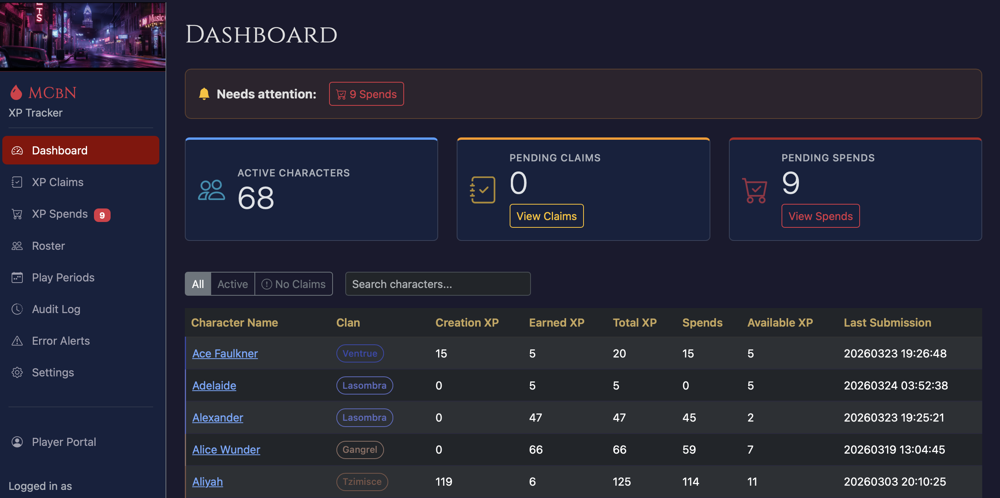
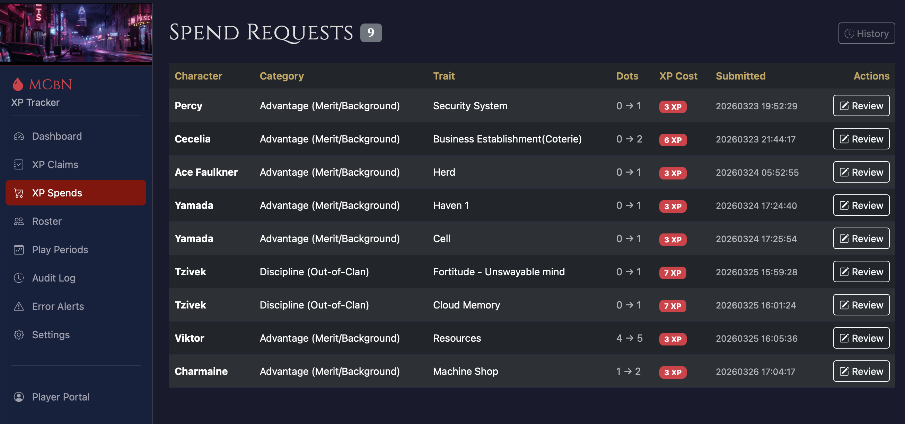
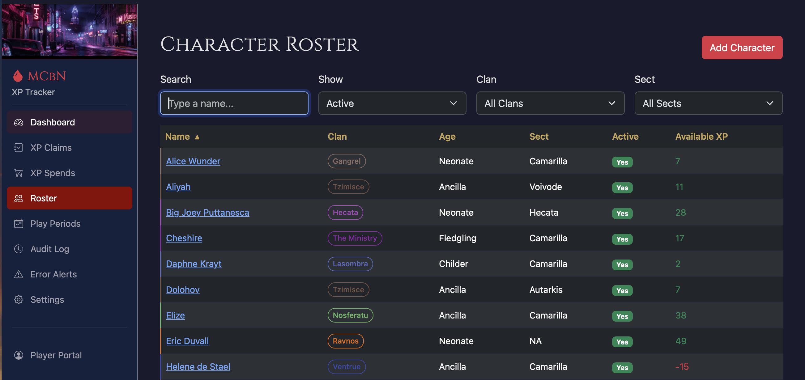
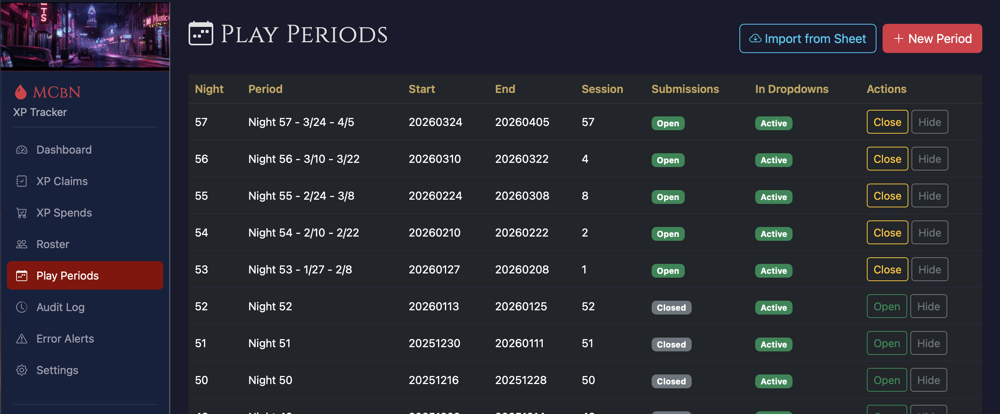
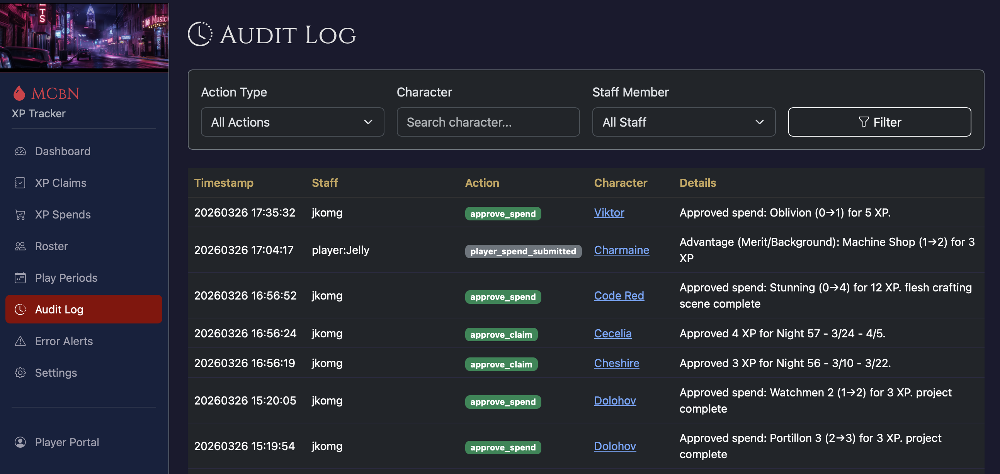
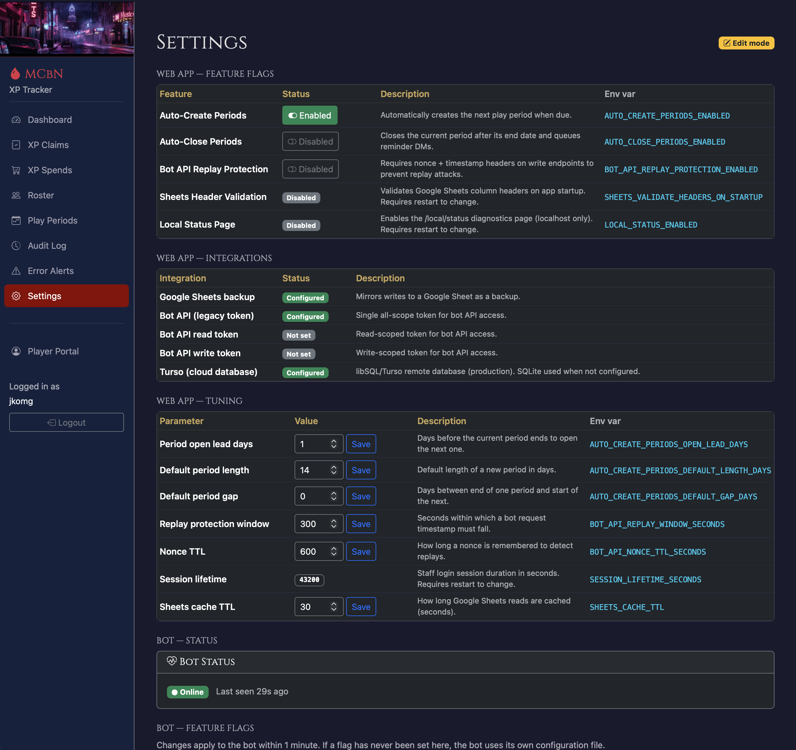
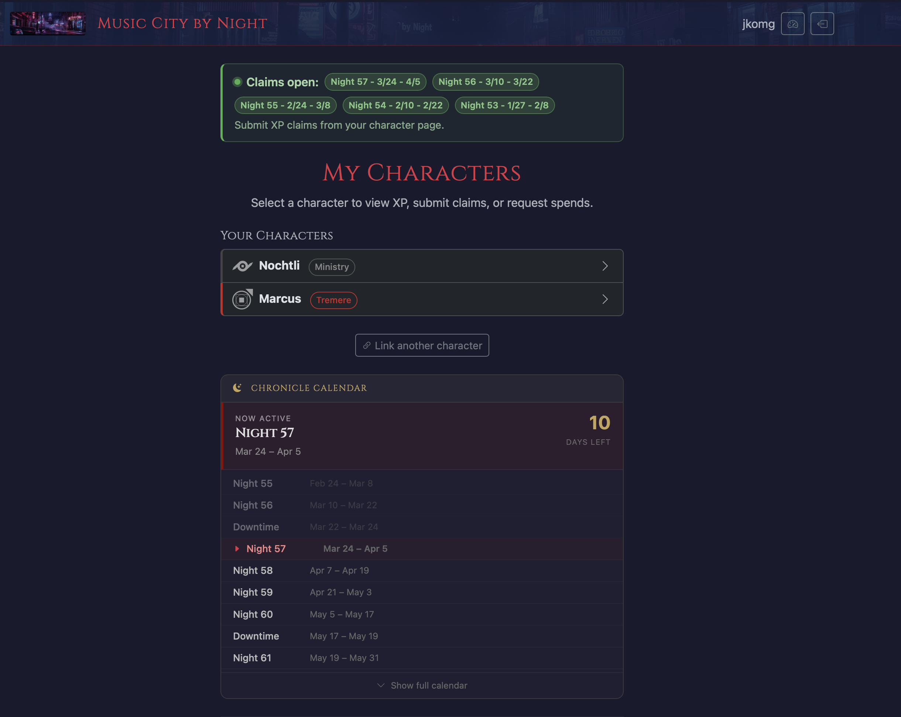
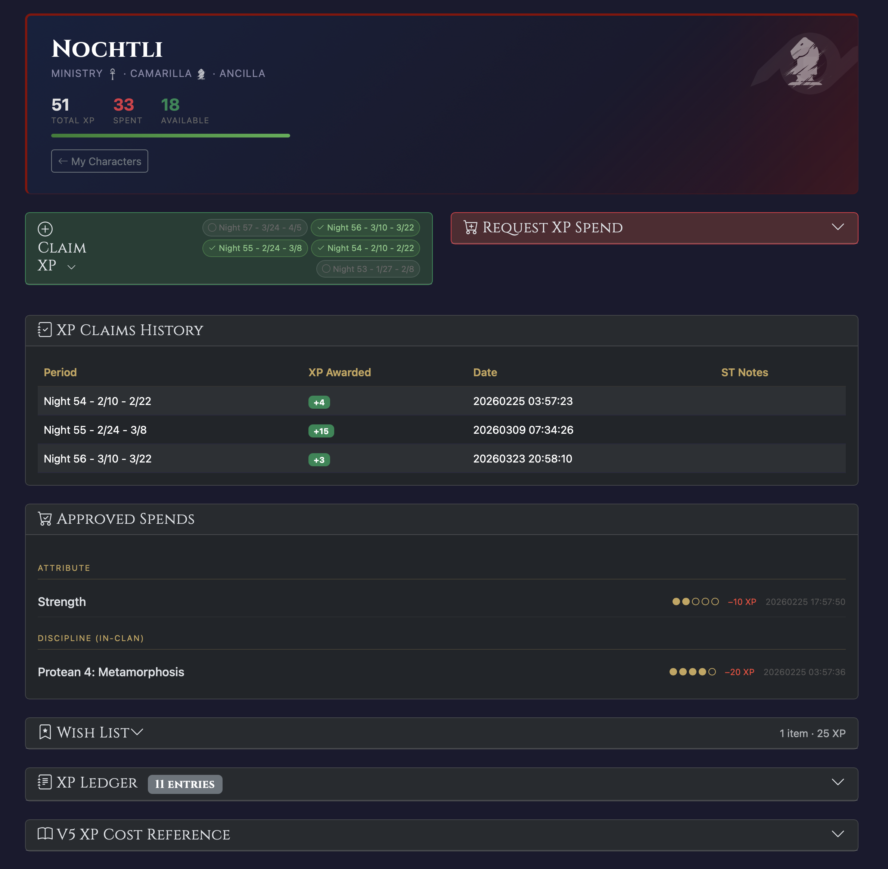
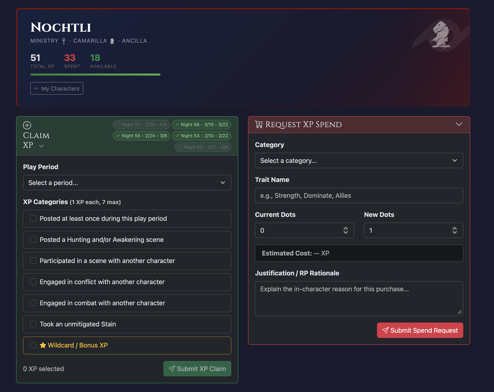

# Web App

## Overview

The web app (`apps/web`) is a Flask 3.x application (Python 3.12) deployed on Google Cloud Run. It is the system of record for all XP data and is the only component that reads from or writes to the database.

- **Admin UI:** Staff-only dashboard for reviewing claims/spends, managing the character roster, and configuring periods and settings. Login via Discord OAuth.
- **Player portal:** Players log in with Discord OAuth to view their characters and submit XP claims and spend requests.
- **REST API:** Bot-facing endpoints under `/api/*` authenticated with a bearer token. See [API_ENDPOINTS.md](API_ENDPOINTS.md).
- **Database:** Turso (libsql) in production; SQLite locally. Schema is created automatically on startup.
- **Google Sheets backup:** Every write to the database is mirrored to a Google Sheet in the background. Sheets is never read for primary data — it exists as a human-readable backup only.

## Admin UI Screens

### Dashboard

The landing page for staff after login. Displays:

- **Attention banner** — shown when there are pending spends awaiting review (e.g. "Needs attention: 9 Spends").
- **Stat cards** — Active Characters count, Pending Claims count (with "View Claims" button), Pending Spends count (with "View Spends" button).
- **Character table** — filterable by All / Active / No Claims tabs. Columns: Character Name (linked to detail page), Clan (colored badge), Creation XP, Earned XP, Total XP, Spends, Available XP, Last Submission. Available XP is highlighted in orange/yellow when positive and red when negative.

### XP Claims

Lists all pending XP claim submissions. Staff review each claim, verify the Discord evidence links for each category checked, and either approve (optionally adjusting the XP amount) or deny (with a note). After review the claim moves out of the pending queue and the audit log is updated.

### XP Spends (Spend Requests)

Lists pending spend requests. Columns: Character, Category (e.g. "Advantage (Merit/Background)", "Discipline (Out-of-Clan)"), Trait, Dots (current → new), XP Cost (shown as a red badge), Submitted timestamp, Actions (Review button). A History button in the top-right shows previously reviewed spends. The system auto-calculates the verified XP cost from V5 rules for comparison against the requested cost.

### Character Roster

Searchable, filterable list of all characters. Filters: Show (Active / Inactive / All), Clan, Sect. Columns: Name (linked), Clan (colored badge), Age (Fledgling / Childer / Neonate / Ancilla), Sect (Camarilla / Anarch / Autarkis / Voivode / Hecata), Active (Yes badge), Available XP (red when negative). Add Character button top-right.

Each character's detail page shows their full XP history — all claims, spends, and ledger entries — and provides an Adjust XP button for manual corrections.

### Play Periods

Manages the two-week play periods (called "nights"). Columns: Night number, Period label (e.g. "Night 57 - 3/24 - 4/5"), Start date, End date, Session count, Submissions (Open / Closed badge), In Dropdowns (Active badge), Actions (Open/Close and Hide buttons).

Staff can open and close submission windows, hide old periods from player-facing dropdowns, and import periods from an external Google Sheet. The + New Period button creates a period manually. Auto-creation and auto-closing can be delegated to the bot (see Settings).

### Error Alerts

`/audit/errors` — shows warn and error log entries persisted from the web app and bot. Entries are written automatically when unhandled exceptions, sync failures, or other error-level events occur.

- **Filter bar** — filter by Source (bot / web), Level (warn / error), or Event name substring.
- **Top Events** — clickable badges showing the most frequent event types for quick filtering.
- **Dismiss button** — staff can dismiss individual entries (✓ button per row). Dismissed entries are hidden by default; the **Show dismissed** toggle reveals them.
- **Sheets Sync Errors** — a separate card at the top lists recent Google Sheets sync failures (timestamp, operation, error message).

---

### Audit Log

A full history of every staff action. Filterable by Action Type, Character, and Staff Member. Columns: Timestamp, Staff (Discord name), Action (colored badge), Character (linked), Details.

Action badge types include: `approve_spend` (green), `deny_spend` (red), `approve_claim` (green), `deny_claim` (red), `player_spend_submitted` (grey), `player_claim_submitted` (grey), and others.

### Settings

The Settings page includes web-app runtime controls plus bot operations panels.

**Feature Flags** — toggle server-side behaviors. Each flag shows its name, current status (Enabled / Disabled), a description, and the backing env var. Flags:

| Flag | Default | Description |
|------|---------|-------------|
| Auto-Create Periods | Disabled | Bot calls `/api/periods/auto-create` on schedule |
| Auto-Close Periods | Disabled | Bot calls `/api/periods/auto-close` on schedule |
| Bot API Replay Protection | Disabled | Require timestamp + nonce headers on write endpoints |
| Sheets Header Validation | Disabled | Validate Google Sheets tab headers on startup |
| Local Status Page | Disabled | Enable `/local/status` diagnostics page |

**Integrations** — shows configuration status of external services (Configured / Not set):
- Google Sheets backup
- Bot API legacy token, read token, write token
- Turso cloud database

**Tuning** — editable numeric parameters (spinners with Save buttons):

| Parameter | Default | Description |
|-----------|---------|-------------|
| Period open lead days | 1 | Days before period end to open the next period |
| Default period length | 14 | Days |
| Default period gap | 0 | Days between periods |
| Replay protection window | 300 s | How far bot request timestamps can differ from server time |
| Nonce TTL | 600 s | How long nonces are tracked for replay detection |
| Notion sync stale threshold | 3600 s | Marks sync status as stale after this running duration |
| Session lifetime | 43200 s | Staff session cookie lifetime |
| Sheets cache TTL | 30 s | How long Sheets reads are cached |

**Bot Status + Notion Sync** — operational controls for bot lifecycle and wiki/notion sync:
- Bot heartbeat status (Online / Delayed / Offline) with restart/rebuild controls.
- Manual **Run Notion Sync** queue button for staff (disabled when the bot reports missing `NOTION_TOKEN` or `DISCORD_GUILD_ID` prerequisites).
- Live sync state badges (Queued / Running / Success / Error / Stale).
- `Reset Stale` action for settings admins to clear stuck sync status keys and safely requeue.
- Recent sync runs table (run ID, source, started/finished, duration, final status, error) aggregated from persisted `notion_sync_events`.

## Player Portal

Players log in via Discord OAuth at `/player`. The portal is scoped to their Discord account — they can only see characters linked to their Discord ID.

### My Characters

The landing page for players after Discord login. Layout:

- **Claims open banner** — green banner listing all currently open play periods (e.g. "Night 57 - 3/24 - 4/5") with the prompt "Submit XP claims from your character page."
- **Your Characters** — cards for each character linked to the player's Discord account, showing the character name, clan badge, and clan icon. Clicking a card opens the character detail view.
- **Link another character** — button to associate an additional character with the player's Discord account.
- **Chronicle Calendar** — shows the currently active night ("Now Active: Night 57, Mar 24 – Apr 5, 10 days left") highlighted in a dark card, with past and upcoming nights and downtime periods listed chronologically. A "Show full calendar" link expands the full schedule.

### Character View

The character detail page has a header card showing:
- Character name, clan, sect, and age category
- XP totals: **Total XP** (white), **Spent** (red), **Available** (green)
- A progress bar reflecting available XP
- A "← My Characters" back link

Below the header are two side-by-side action panels:

**Claim XP (left panel)**

Shows a row of recent play period pills — each pill displays the period label (e.g. "Night 56 - 3/10 - 3/22") with a checkmark if already claimed for that period, or a hollow circle if not yet claimed.

To submit a claim:
1. Select a play period from the dropdown.
2. Check any applicable XP categories (1 XP each, 7 max):
   - Posted at least once during this play period
   - Posted a Hunting and/or Awakening scene
   - Participated in a scene with another character
   - Engaged in conflict with another character
   - Engaged in combat with another character
   - Took an unmitigated Stain
   - ⭐ Wildcard / Bonus XP (highlighted in gold — for staff-awarded bonus XP)
3. The running total is shown at the bottom ("0 XP selected").
4. Click **Submit XP Claim**.

**Request XP Spend (right panel)**

To request a spend:
1. Select a category (e.g. Discipline In-Clan, Advantage Merit/Background, Ghoul Discipline).
2. Enter the trait name (e.g. "Dominate", "Allies").
3. Set Current Dots and New Dots — the **Estimated Cost** updates automatically using V5 XP rules.
4. Write a Justification / RP Rationale explaining the in-character reason.
5. Click **Submit Spend Request**.

Both panels open simultaneously, as shown below:

Both submissions go into the pending queue for staff review.

**Backgrounds tab**

Characters that have tracked backgrounds (e.g. Herd, Allies) show a **Backgrounds** tab below the action panels. Each row lists the background name, total dots, currently blanked dots, available dots, and the scheduled release night if blanked. Blanking is triggered by the bot (hunt consequence); release happens automatically at the start of the next night via the bot's passage-of-time monitor. Players receive a Discord notification in their character's cubby channel when the review is complete.

## Staff Workflows

### Reviewing Claims

1. Log in at the site root with Discord.
2. Click **XP Claims** (pending count shown in sidebar badge).
3. For each claim: verify Discord evidence links for each checked category.
4. **Approve** (optionally adjust the XP amount) or **Deny** (with a required note).

### Reviewing Spends

1. Click **XP Spends**.
2. The verified XP cost is calculated automatically from V5 rules. A mismatch between requested and verified cost is flagged. Ghoul Discipline spends are flat 10 XP per dot (0→1 only).
3. **Approve** or **Deny** (with a note).

### Managing the Roster

- Add, edit, activate, or deactivate characters from the Roster screen.
- Use **Adjust XP** on a character detail page to grant XP, remove XP, refund a spend, or record a manual spend.

### Managing Periods

- Open or close submission windows from the Play Periods screen.
- Enable auto-create / auto-close on the Settings page to delegate period management to the bot.

## Architecture Notes

- The web app is the sole authority for XP data. The bot and any other clients call web API endpoints and never access the database or Sheets directly.
- Google Sheets writes are fire-and-forget (run in a background thread). A Sheets failure does not block or roll back a database write.
- XP math: `Total XP = Creation XP + Approved Claims + Ledger Awards`. `Available XP = Total XP - Approved Spends - Ledger Spends`.
- Staff are identified by Discord ID in the `ALLOWED_DISCORD_IDS` env var. Everyone else who logs in via Discord OAuth is treated as a player and can only see their own characters.
